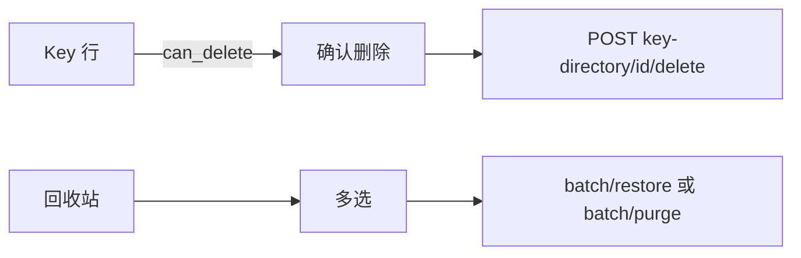

# Key 删除与回收站批量 UI

网页只消费服务端合同，不持有密钥明文或回收站状态。

```mermaid
flowchart LR
  A[Key 行] -->|can_delete| B[确认删除]
  B --> C[POST key-directory/id/delete]
  D[回收站] --> E[多选]
  E --> F[batch/restore 或 batch/purge]
```
