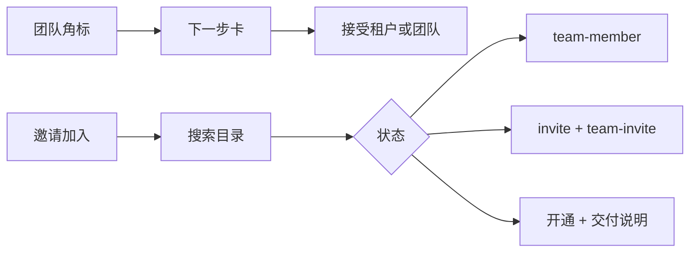

# Web 邀请旅程

被邀请人用 approval queue（一张下一步卡）。管理员用右侧抽屉作曲器 + 成员表。令牌只用 `src/style.css` `:root`。

```mermaid
flowchart LR
  badge[团队角标] --> card[下一步卡]
  card --> accept[接受租户或团队]
  compose[邀请加入] --> search[搜索目录]
  search --> path{状态}
  path --> add[team-member]
  path --> invite[invite + team-invite]
  path --> provision[开通 + 交付说明]
```

深链 `#/teams?invite=` 只滚到对应卡，不是令牌。`CreateIdentity` 仍只服务用户目录。
